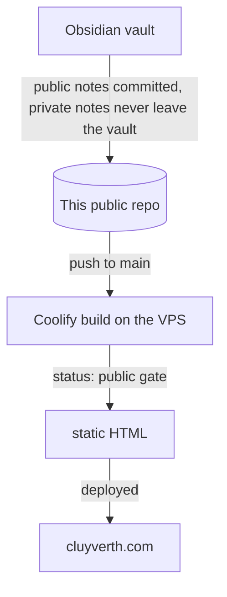

Cluyverth Hub is the project behind this site. It is a static website that publishes a public slice of my Obsidian vault, with no backend, no accounts and no database.

## Concept

I write everything in Obsidian. The site is the filtered version of that writing, a vault, a graph, a few guides, a projects page and a links page. Publishing should be as simple as writing, so the whole pipeline runs at build time and the result is plain static HTML served from the VPS.

## Why a static site

The content is markdown and read-only, so a server would add cost, attack surface and maintenance with nothing in return. Static HTML serves instantly, costs almost nothing, and has nothing to hack because no code is running. This is the good decision behind the whole project, and everything else follows from it.

## Why everything is in one public repo

This repo is public and it holds both the site code and the public notes. Writing a note, committing it and pushing to main is the whole publishing flow. There is no second repo to sync, no token to protect and no build-time cloning, so there is nothing to misconfigure and no secret that could leak.

Privacy moves to the source: the `private/` folder inside `.notes/` is ignored by the `.gitignore`, so anything placed there is never committed. And because the repo is public, anyone can audit exactly what is public, because the whole thing is public.

## The publishing pipeline

1. Notes are written in Obsidian. Public notes are committed to this repo under `.notes/`, in the `en-us` and `pt-br` folders. Anything private goes into the `private/` folder, which the `.gitignore` keeps out of git.
2. Pushing to `main` triggers the Coolify build.
3. The build reads every note and renders only `status: public` ones. Drafts render in dev only, private notes never render.
4. The output is static HTML deployed by Coolify to the VPS.

## Why the status gate

The `status` field is the second layer of privacy. If a non-public note somehow reached the repo, the gate still filters it before it can reach the internet. Two independent mechanisms mean one failure cannot leak anything. Publishing is then just changing `draft` to `public` and pushing.

## CI/CD

Pushing to `main` triggers Coolify: `astro check` for types, then `astro build` for the static output, then deploy. There is no runtime server.

Note-only updates are commits to this repo, so they trigger the same build as code changes, automatically.

## Astro islands and hydration

Astro renders pages to static HTML by default, zero JavaScript unless a component needs it. An **island** is an interactive component that gets hydrated in the browser while everything around it stays static. This is the "hydrate when needed" rule, and it is why the site stays fast without giving up interactivity.

What is hydrated on this site and why:

- **The graph**: a force-directed layout needs continuous client side computation, it cannot be pre-rendered.
- **Table of contents scrollspy**: tracks scroll position, which only exists in the browser.
- **Vault search and notebook filters**: instant client side filtering.
- **Mermaid diagrams**: rendered in the browser when a note contains one.
- **Theme toggle and back to top**: small inline scripts, no framework.

What is NOT hydrated: note pages, the vault list, projects, about, links. They are pure HTML and CSS, so they load instantly and work without JavaScript.

## The frontmatter contract

Every note carries the same frontmatter: `title`, `date`, `status` (public, draft, private), `lang` (en, pt), `translation` (the counterpart note), and optionally `slug`, `author`, `tags`, `category`, `notebook`, `description`, `project`, `stack`, `image`. The [[how-to-write-notes]] guide explains every field.

## Internationalization

Notes live in `en-us/` and `pt-br/` folders with mirrored filenames. English is the default at `/`, Portuguese lives under `/pt`. The PT | EN toggle switches the whole site, and each note has a translated mirror paired through the `translation` field. The Portuguese texts are written in Brazilian Portuguese, not machine-translated.

## Reading guides

- [[rss-guide]]: how to follow the site with an RSS reader
- [[how-to-write-notes]]: how to write notes for this project, markdown or MDX
