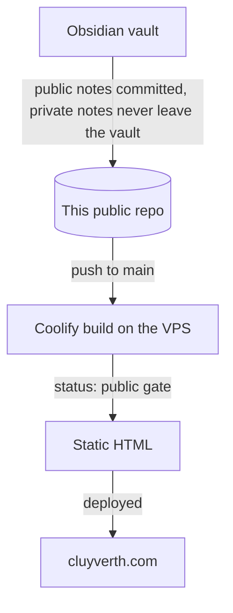

**The source of [cluyverth.com](https://cluyverth.com).** A static site that publishes a public slice of an Obsidian vault, with no backend, no accounts and no database.

<div class="badges">

[](https://astro.build)
[](https://tailwindcss.com)
[](https://typescriptlang.org)
[](https://bun.sh)
[](https://github.com/Cluyverth/Cluyverth-Hub/blob/main/LICENSE)

</div>

## What it is

I write everything in Obsidian. The site is the filtered version of that writing: a vault, a graph, guides, a projects page and a links page. Publishing is a single action: write the note, commit it, push to `main`, and Coolify rebuilds the site. The whole pipeline runs at build time and the result is plain static HTML served from a VPS.

- **For the reader:** fast pages, a searchable vault with notebook filters, a force graph, RSS feeds and a PT | EN toggle.
- **For me:** writing stays in Obsidian, publishing is a git push, privacy is enforced at the source, and the build fails on a broken shape instead of shipping a broken page.

## Screenshots

| Home | Vault |
| --- | --- |
|  |  |

## What the site delivers

- **A public slice of the vault** — notes render only with `status: public`; drafts render in local dev, private notes never render. The gate is defense in depth: even if a non-public note reached the repo, the build filters it before it can reach the internet.
- **A projects page** — notes with `project: true` become project cards with cover image, stack and description.
- **A force graph** — wikilink edges computed at build time from the same resolution that renders the pages, so pages and graph can never disagree.
- **Instant vault search** — client-side search with notebook filter pills.
- **A typed links page** — links live in one typed TypeScript file, so the build fails if the shape breaks.
- **RSS feeds** — English and Portuguese feeds generated at build time.
- **Full internationalization** — mirrored notes in `en-us/` and `pt-br/`, PT notes resolve PT wikilinks, and the PT | EN toggle switches the whole site.
- **Islands only where needed** — the graph, search, table of contents scrollspy and Mermaid diagrams hydrate in the browser; reading pages are pure HTML and CSS, so they load instantly and work without JavaScript.
- **Zero external requests** — self-hosted Inter variable font, no third-party fonts, no tracking.

## Stack

| Layer | Choice | Why |
| --- | --- | --- |
| Framework | **Astro 7** | Static HTML by default; only true islands ship JavaScript |
| Markdown | **Sätteri engine** | Obsidian wikilinks resolved at build time, feeding pages and graph alike |
| Styling | **Tailwind CSS 4** | The carcará palette (ink, paper, terra, gold) as CSS tokens, class-based dark mode |
| Language | **TypeScript strict** | No `any`, no type-skipping; `astro check` gates every build |
| Runtime | **Bun** | Fast install and build, pinned by the Dockerfile on the server |
| Fonts | **Inter variable** | Self-hosted via @fontsource, zero external font requests |
| Content | **Typed frontmatter** | A Zod schema validates every note at build time |

## How a note reaches the site



1. Notes are written in Obsidian. Public notes are committed to this repo under `.notes/` (`en-us` and `pt-br` folders). Private notes never leave the vault, the vault `.gitignore` keeps them out of git.
2. Pushing to `main` triggers the Coolify build.
3. The build reads every note and renders only `status: public` ones.
4. The output is static HTML deployed by Coolify to the VPS.

## How to run

Requires [Bun](https://bun.sh).

```sh
bun install
bun run dev        # development server with hot reload
bun run build      # astro check, then the static build into dist/
bun run preview    # serve the build locally
```

The notes are already in the repo under `.notes/`, so no setup is needed.

## Structure

```
├── src/                       ← site code: pages, components, layouts, libs
│   ├── pages/                 ← home, vault, projects, links, graph, about, 404
│   ├── components/            ← UI pieces and islands (graph, search, TOC)
│   ├── lib/                   ← notes, wikilinks, graph data, i18n
│   └── content.config.ts      ← note schema (Zod)
├── .notes/                    ← the public notes (en-us/ and pt-br/)
│   └── .gitignore             ← keeps private/ out of git
├── Dockerfile                 ← pins the Bun version for the Coolify build
├── astro.config.mjs
└── package.json
```

## Deploy

### Coolify (own VPS)

The repo includes a multi-stage [`Dockerfile`](https://github.com/Cluyverth/Cluyverth-Hub/blob/main/Dockerfile) that pins the exact Bun version of the lockfile (1.3.14), builds the site and serves it with Nginx. On Coolify: **Create New Resource → Public Repository** → Build Pack **Dockerfile** → set the domain and deploy. The site rebuilds on every push, with no environment variables and no secrets.

## Privacy guarantees

- The `.notes/.gitignore` ignores the `private/` folder, so anything private placed there is never committed to this repo, structurally.
- The `status` gate filters everything at build time, as a second layer.
- The repo is public, so everything in it is public by construction, and auditable.

A private note has no path from the vault to the internet.

## License

[MIT](https://github.com/Cluyverth/Cluyverth-Hub/blob/main/LICENSE) © 2026 Cluyverth Pereira

## Reading guides

- [[rss-guide]]: how to follow the site with an RSS reader
- [[how-to-write-notes]]: how to write notes for this project, markdown or MDX
