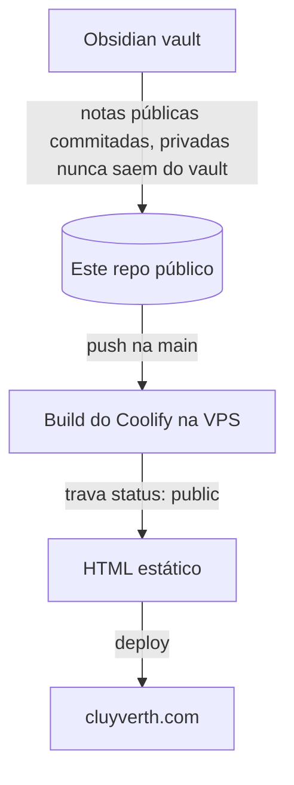

**A fonte do [cluyverth.com](https://cluyverth.com).** Um site estático que publica uma fatia pública de um vault do Obsidian, sem backend, sem contas e sem banco de dados.

<div class="badges">

[](https://astro.build)
[](https://tailwindcss.com)
[](https://typescriptlang.org)
[](https://bun.sh)
[](https://github.com/Cluyverth/Cluyverth-Hub/blob/main/LICENSE)

</div>

## O que é

Escrevo tudo no Obsidian. O site é a versão filtrada dessa escrita: um vault, um grafo, guias, uma página de projetos e uma página de links. Publicar é uma ação única: escrever a nota, commitar, dar push na `main`, e o Coolify rebuilda o site. Todo o pipeline roda no momento do build e o resultado é HTML estático servido da VPS.

- **Para o leitor:** páginas rápidas, um vault pesquisável com filtros de caderno, um grafo de forças, feeds RSS e o seletor PT | EN.
- **Para mim:** a escrita fica no Obsidian, publicar é um git push, a privacidade é garantida na origem, e o build falha em formato quebrado em vez de publicar página quebrada.

## Screenshots

| Home | Vault |
| --- | --- |
|  |  |

## O que o site entrega

- **Uma fatia pública do vault** — as notas renderizam apenas com `status: public`; rascunhos renderizam só em dev local, notas privadas nunca renderizam. A trava é defesa em profundidade: mesmo se uma nota não pública chegasse ao repo, o build a filtra antes de chegar à internet.
- **Uma página de projetos** — notas com `project: true` viram cards de projeto com capa, stack e descrição.
- **Um grafo de forças** — as arestas dos wikilinks são calculadas no build com a mesma resolução que renderiza as páginas, então páginas e grafo nunca divergem.
- **Busca instantânea no vault** — busca no cliente com pills de filtro por caderno.
- **Uma página de links tipada** — os links vivem em um único arquivo TypeScript tipado, então o build falha se a forma quebrar.
- **Feeds RSS** — feeds em inglês e português gerados no build.
- **Internacionalização completa** — notas espelhadas em `en-us/` e `pt-br/`, notas PT resolvem wikilinks PT, e o seletor PT | EN troca o site inteiro.
- **Islands só onde precisam** — grafo, busca, scrollspy do sumário e diagramas Mermaid hidratam no navegador; páginas de leitura são HTML e CSS puros, carregam na hora e funcionam sem JavaScript.
- **Zero requests externos** — fonte Inter variável self-hosted, sem fontes de terceiros, sem rastreamento.

## Stack

| Camada | Escolha | Por quê |
| --- | --- | --- |
| Framework | **Astro 7** | HTML estático por padrão; só islands de verdade enviam JavaScript |
| Markdown | **Motor Sätteri** (motor de markdown do Astro 7) | Wikilinks do Obsidian resolvidos no build, alimentando páginas e grafo igualmente |
| Estilo | **Tailwind CSS 4** | A paleta carcará (ink, paper, terra, gold) como tokens CSS, dark mode por classe |
| Linguagem | **TypeScript strict** | Sem `any`, sem pular tipos; `astro check` trava todo build |
| Runtime | **Bun** | Instalação e build rápidos, fixado pelo Dockerfile no servidor |
| Fontes | **Inter variable** | Self-hosted via @fontsource, zero requests externos de fonte |
| Conteúdo | **Frontmatter tipado** | Um schema Zod valida toda nota no build |

## Como uma nota chega ao site



1. As notas são escritas no Obsidian. Notas públicas são commitadas neste repo em `.notes/` (pastas `en-us` e `pt-br`). Notas privadas nunca saem do vault, o `.gitignore` do vault as mantém fora do git.
2. Push na `main` dispara o build do Coolify.
3. O build lê todas as notas e renderiza apenas as com `status: public`.
4. O resultado é HTML estático publicado pelo Coolify na VPS.

## Como rodar

Requer [Bun](https://bun.sh).

```sh
bun install
bun run dev        # servidor de desenvolvimento com hot reload
bun run build      # astro check, depois o build estático em dist/
bun run preview    # serve o build localmente
```

As notas já estão no repo em `.notes/`, então não precisa de setup.

## Estrutura

```
├── src/                       ← código do site: páginas, componentes, layouts, libs
│   ├── pages/                 ← home, vault, projects, links, graph, about, 404
│   ├── components/            ← peças de UI e islands (graph, search, TOC)
│   ├── lib/                   ← notas, wikilinks, dados do grafo, i18n
│   └── content.config.ts      ← schema das notas (Zod)
├── .notes/                    ← as notas públicas (en-us/ e pt-br/)
│   └── .gitignore             ← mantém private/ fora do git
├── Dockerfile                 ← fixa a versão do Bun no build do Coolify
├── astro.config.mjs
└── package.json
```

## Deploy

### Coolify (VPS própria)

O repo inclui um [`Dockerfile`](https://github.com/Cluyverth/Cluyverth-Hub/blob/main/Dockerfile) multi-stage que fixa a versão exata do Bun do lockfile (1.3.14), builda o site e serve com Nginx. No Coolify: **Create New Resource → Public Repository** → Build Pack **Dockerfile** → defina o domínio e faça o deploy. O site rebuila a cada push, sem variáveis de ambiente e sem segredos.

## Garantias de privacidade

- O `.notes/.gitignore` ignora a pasta `private/`, então qualquer coisa privada colocada lá nunca é commitada neste repo, estruturalmente.
- A trava de `status` filtra tudo no build, como segunda camada.
- O repo é público, então tudo nele é público por construção e auditável.

Uma nota privada não tem caminho do vault até a internet.

## Licença

[MIT](https://github.com/Cluyverth/Cluyverth-Hub/blob/main/LICENSE) © 2026 Cluyverth Pereira

## Guias de leitura

- [[rss-guide]]: como acompanhar o site com um leitor de RSS
- [[how-to-write-notes]]: como escrever notas para este projeto, markdown ou MDX
