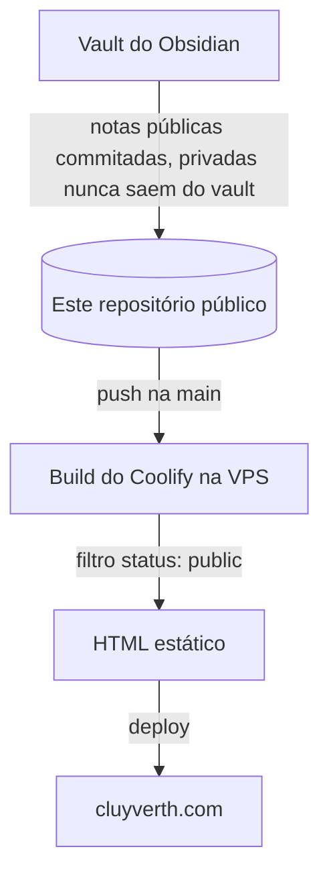

O Cluyverth Hub é o projeto por trás deste site. É um site estático que publica uma fatia pública do meu vault do Obsidian, sem backend, sem contas e sem banco de dados.

## Conceito

Escrevo tudo no Obsidian. O site é a versão filtrada dessa escrita: um vault, um grafo, alguns guias, uma página de projetos e uma página de links. Publicar deve ser tão simples quanto escrever, então todo o pipeline roda no momento do build e o resultado é HTML estático servido da VPS.

## Por que um site estático

O conteúdo é markdown e somente leitura, então um servidor só traria custo, superfície de ataque e manutenção, sem retorno nenhum. HTML estático carrega na hora, custa quase nada e não há o que invadir, porque nenhum código fica rodando. Essa é a boa decisão por trás do projeto inteiro, e tudo o mais segue a partir dela.

## Por que tudo está em um único repositório público

Este repositório é público e guarda tanto o código do site quanto as notas públicas. Escrever uma nota, commitá-la e dar push na main é o fluxo inteiro de publicação. Não existe um segundo repositório para sincronizar, nem token para proteger, nem clone no build, então não há o que configurar errado nem segredo que possa vazar.

A privacidade passa a ser garantida na origem: a pasta `private/` dentro de `.notes/` é ignorada pelo `.gitignore`, então qualquer coisa colocada ali nunca é commitada. E como o repositório é público, qualquer pessoa pode auditar exatamente o que é público, porque tudo nele é público.

## O pipeline de publicação

1. As notas são escritas no Obsidian. As públicas são commitadas neste repositório, na pasta `.notes/`, nas pastas `en-us` e `pt-br`. O que for privado vai para a pasta `private/`, que o `.gitignore` mantém fora do git.
2. Push na `main` dispara o build do Coolify.
3. O build lê cada nota e renderiza somente as com `status: public`. Rascunhos aparecem apenas em dev, notas privadas nunca são renderizadas.
4. O resultado é HTML estático publicado pelo Coolify na VPS.

## Por que o controle de status

O campo `status` é a segunda camada de privacidade. Se uma nota não pública chegar de alguma forma ao repositório, o filtro ainda a barra antes que ela alcance a internet. Dois mecanismos independentes garantem que uma falha isolada não vaze nada. Publicar vira só trocar `draft` para `public` e dar push.

## CI/CD

Push na `main` dispara o Coolify: `astro check` para os tipos, depois `astro build` para o HTML estático, depois o deploy. Não existe servidor em runtime.

Atualizações só de notas são commits neste repositório, então disparam o mesmo build que mudanças de código, automaticamente.

## Ilhas Astro e hidratação

O Astro renderiza as páginas como HTML estático por padrão, zero JavaScript a menos que um componente precise. Uma **ilha** é um componente interativo que é hidratado no navegador enquanto todo o resto permanece estático. Essa é a regra do "hidrate quando precisar", e é por isso que o site continua rápido sem abrir mão da interatividade.

O que é hidratado neste site e por quê:

- **O grafo**: um layout de forças precisa de cálculo contínuo no cliente, não dá para pré-renderizar.
- **Sumário com scrollspy**: acompanha a posição do scroll, que só existe no navegador.
- **Busca do vault e filtros de caderno**: filtragem instantânea no cliente.
- **Diagramas Mermaid**: renderizados no navegador quando uma nota contém um.
- **Alternador de tema e voltar ao topo**: pequenos scripts inline, sem framework.

O que NÃO é hidratado: páginas de nota, a lista do vault, projetos, sobre e links. São HTML e CSS puros, carregam na hora e funcionam sem JavaScript.

## O contrato de frontmatter

Toda nota carrega o mesmo frontmatter: `title`, `date`, `status` (public, draft, private), `lang` (en, pt), `translation` (a nota correspondente), e opcionalmente `slug`, `author`, `tags`, `category`, `notebook`, `description`, `project`, `stack`, `image`. O guia [[how-to-write-notes]] explica cada campo.

## Internacionalização

As notas vivem nas pastas `en-us/` e `pt-br/` com nomes de arquivo espelhados. O inglês é o padrão em `/`, o português fica em `/pt`. O alternador PT | EN troca o site inteiro, e cada nota tem uma tradução espelhada ligada pelo campo `translation`. Os textos em português são escritos em português brasileiro, não tradução automática.

## Guias de leitura

- [[rss-guide]]: como acompanhar o site com um leitor de RSS
- [[how-to-write-notes]]: como escrever notas para este projeto, em markdown ou MDX
