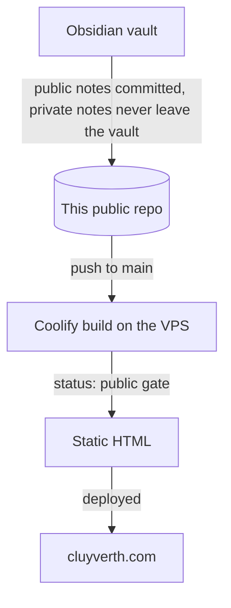

# Cluyverth Hub

The source of [cluyverth.com](https://cluyverth.com). A static site that publishes a public slice of an Obsidian vault, with no backend, no accounts and no database. This repo is public, it contains the site code and the public notes, and private notes never enter it.

## What this project is

I write everything in Obsidian. The site is the filtered version of my writing: a vault, a graph, a few guides, a projects page and a links page. The whole pipeline runs at build time, and the result is plain static HTML served from a VPS.

## The decisions and why they were good

### A static site, with no backend

The content is markdown, read-only, and written by one person. A server would add cost, attack surface, maintenance and scaling worries, with nothing in return. Static HTML serves instantly, costs almost nothing on a VPS, and has nothing to hack because there is no code running.

Astro is the engine. Every page renders to plain HTML by default, and only the components that truly need the browser ship JavaScript, as islands: the force graph, the vault search and filters, the table of contents scrollspy and the Mermaid diagrams. Reading pages are pure HTML and CSS, so they load fast and work without JavaScript.

### One public repo, with the notes committed

There is exactly one repo, this one. It is public, it contains the site code and the public notes, and the build needs nothing else: no second repo to sync, no tokens, no build-time cloning, no secrets to rotate.

This is a good decision because publishing stays a single action. Write the note in Obsidian, commit, push to `main`, and Coolify rebuilds the site. Privacy is enforced at the source: the vault has its own `.gitignore` that keeps private folders and files out of git entirely, so a private note is never committed to this repo. And because the repo is public, anyone can audit exactly what is public, because the whole thing is public.

### The status gate, as defense in depth

Every note carries a `status` field. Only `status: public` renders anywhere. Drafts render in local dev only, and private notes never render at all. The gate is the second layer: even if a non-public note somehow reached the repo, the build filters it before it can reach the internet. Two independent mechanisms, so one failure cannot leak anything.

### A distinctive, content-first design

The carcará palette (ink, paper, terra and gold) comes from the Brazilian cerrado bird that names the brand. Self-hosted Inter covers the whole site, so there are zero external font requests and no third-party tracking. The content is the star, and the design is unmistakably personal.

### Typed data for the links page

Links live in one typed TypeScript file. Adding a link is editing a data file, and the build fails if the shape breaks. No database, no CMS, no admin panel.

### A GitHub flow that scales down to one person

Issues are organized in two levels that keep the structure of three: features and product backlog items (PBIs). A feature is the stakeholder vision, a PBI is a user story with acceptance criteria, and its tasks are a checklist inside the PBI. Each feature gets one branch, and one PR per feature keeps reviews coherent. Squash merging to `main` keeps history linear, and conventional commits keep it readable. See [AGENTS.md](AGENTS.md) for the full working agreements.

## How a note reaches the site



1. Notes are written in Obsidian. Public notes are committed to this repo under `.notes/` (`en-us` and `pt-br` folders). Private notes never leave the vault, the vault `.gitignore` keeps them out of git.
2. Pushing to `main` triggers the Coolify build.
3. The build reads every note in `.notes/` and renders only `status: public` ones.
4. The output is static HTML deployed by Coolify to the VPS.

## Local development

Requires [Bun](https://bun.sh).

```bash
bun install
bun run dev
```

The notes are already in the repo under `.notes/`, so no setup is needed.

## Building and deploying with Coolify

Everything the build needs is in this public repo: `package.json`, `bun.lock`, the Astro config, the content schema, the notes and the static assets. On the VPS, Coolify only needs configuration:

- **Build pack**: Nixpacks (it detects Bun from `bun.lock`).
- **Build command**: `bun run build`
  - This runs `astro check` for type safety, then `astro build` for the static output.
- **Output directory**: `dist`

No environment variables and no secrets are required. Pushing to `main` triggers the build and deploy. There is no runtime server, so nothing listens on a port after the build finishes.

## Privacy guarantees

- The `.notes/.gitignore` ignores the `private/` folder, so anything private placed there is never committed to this repo, structurally.
- The `status` gate filters everything at build time, as a second layer.
- The repo is public, so everything in it is public by construction, and auditable.

A private note has no path from the vault to the internet.

## License

MIT. See [LICENSE](LICENSE).
